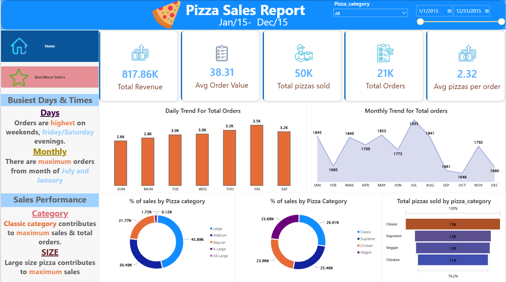
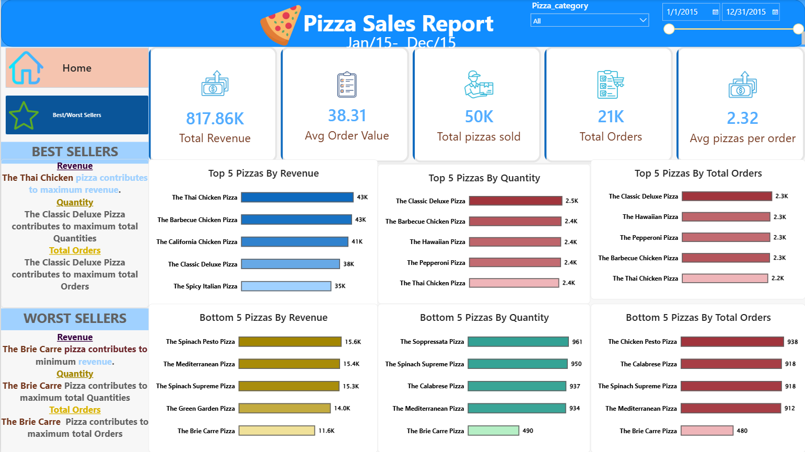
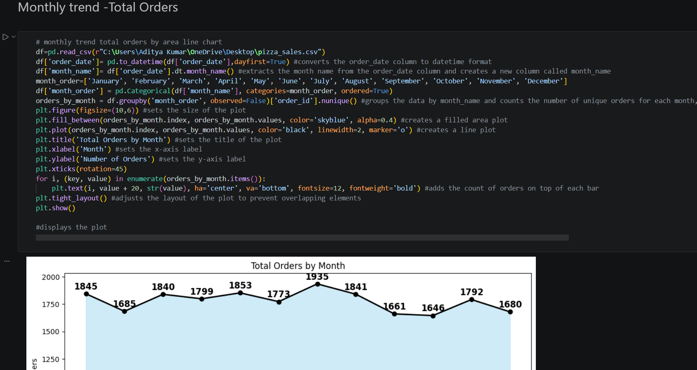

#  Pizza Sales Analysis - Multi-Platform Data Project

This repository showcases an end-to-end data analysis project focusing on pizza sales performance metrics. To demonstrate modern data engineering, analysis, and visualization workflows, the project has been fully built across four distinct platforms: **Power BI, Python (Jupyter Notebook), Excel, and Tableau**.

---

##  Project Workflow
Data Source (.csv)  Data Cleaning & EDA (Python)  Multi-Platform Analysis & Interactive Dashboards (Power BI | Tableau | Excel)

---

##  Project Assets & Interactive Links
*  **Power BI Report:** [Download .pbix File](./powerbi.pbix) *(Click to download & view full interactive DAX model)*
*  **Tableau Public Dashboard:** [View Interactive Tableau Dashboard]([PASTE_YOUR_TABLEAU_PUBLIC_LINK_HERE])
*  **Python Analysis:** [View Jupyter Notebook](./eda.ipynb) *(Click to view code and data visualization workflow)*
*  **Excel File:** [Download Excel Dashboard]([PASTE_YOUR_EXCEL_LINK_OR_PATH_HERE])
----

##  Core Performance Metrics (KPIs)
Based on the full year of data analyzed (Jan 2015 - Dec 2015), the business achieved the following foundational metrics:
* **Total Revenue:** $817.86K
* **Average Order Value:** $38.31
* **Total Pizzas Sold:** 50K
* **Total Orders:** 21K
* **Average Pizzas Per Order:** 2.32

---

##  Platform Implementations

### 1. Python (Jupyter Notebook)
* **Libraries:** `pandas`, `numpy`, `matplotlib`, `seaborn`
* **Key Steps:** Data profiling, handling schema types, extraction of date/time fields, and verifying quantitative aggregation metrics against BI data models.

### 2. Power BI Dashboard
* **Techniques:** Engineered dynamic DAX measures for KPIs, configured time-intelligence functions, implemented dynamic navigation tabs, and established custom conditional filtering.

### 3. Excel Interactive Dashboard
* **Techniques:** Handled extraction transformations via Power Query, designed multi-layer Pivot Tables, and synced interactive slicers across the workspace.

### 4. Tableau Dashboard
* **Techniques:** Implemented discrete dimension tracking, dual-axis progression trendlines, and customized tooltip parameters.

---

##  Key Data Insights & Inferences

###  Busiest Days & Times
* **Daily Trend:** Orders peak significantly on weekends, with **Friday and Saturday evenings** experiencing the highest transaction volumes.
* **Monthly Trend:** The business experiences maximum order volumes during the months of **July and January**.

###  Category & Size Performance
* **Pizza Category:** The **Classic category** is the top performer, contributing the maximum sales revenue and total orders.
* **Pizza Size:** **Large size pizzas** dominate customer preferences, driving the maximum overall sales distribution.

###  Best Sellers (Top 5)
* **By Revenue:** *The Thai Chicken Pizza* leads with highest revenue generation ($43K), closely followed by *The Barbecue Chicken Pizza*.
* **By Quantity & Total Orders:** *The Classic Deluxe Pizza* ranks #1 across both total quantities sold (~2.5K) and total unique orders (~2.3K).

###  Worst Sellers (Bottom 5)
* **By Revenue, Quantity, & Total Orders:** *The Brie Carre Pizza* is the lowest performer across all dimensions, generating minimum revenue ($11.6K), lowest quantities sold (~490), and lowest total orders (~480).

---

##  Dashboard Previews & Screenshots

###  Power BI - Home Dashboard View
Below is the core executive layout featuring total revenue distribution, volume trends, and structural breakdowns by category and size.

###  Power BI - Best / Worst Sellers View
Below is the specialized performance breakout tracking top-tier and underperforming pizza menu items.

###  Tableau Dashboard Preview

###  Excel Dashboard Preview

###  Python EDA Visualization Preview

---

##  Tools, Libraries & Technologies Used

###  Python Data Stack
* **Core Analytics:** `Pandas` (Data manipulation, cleaning, and structural aggregations), `NumPy` (Vectorized numerical operations).
* **Data Visualization:** `Matplotlib` (Custom trends and layout design), `Seaborn` (Advanced statistical data plots), `Plotly Express` (Dynamic, interactive browser-ready visualizations).
* **Package Management & Warnings:** `warnings` (Runtime filter optimization).

###  Business Intelligence & Dashboarding
* **Power BI Desktop:** Advanced data modeling, DAX measure calculations (KPI engineering), custom conditional formatting, and time-intelligence reporting.
* **Tableau Public:** Dynamic visual design, worksheet actions, and custom formatting.
* **Microsoft Excel:** Power Query for data parsing, Pivot Tables, and interactive dashboard Slicers.

### 🖥️ Environments, IDEs & Version Control
* **Visual Studio Code (VS Code):** Used as the primary IDE for script management and Jupyter Notebook execution.
* **Jupyter Notebooks:** Interactive exploration workspace for testing cleaning pipelines and markdown notation.
* **Git & GitHub:** Repository version control, asset tracking, and open-source documentation.
